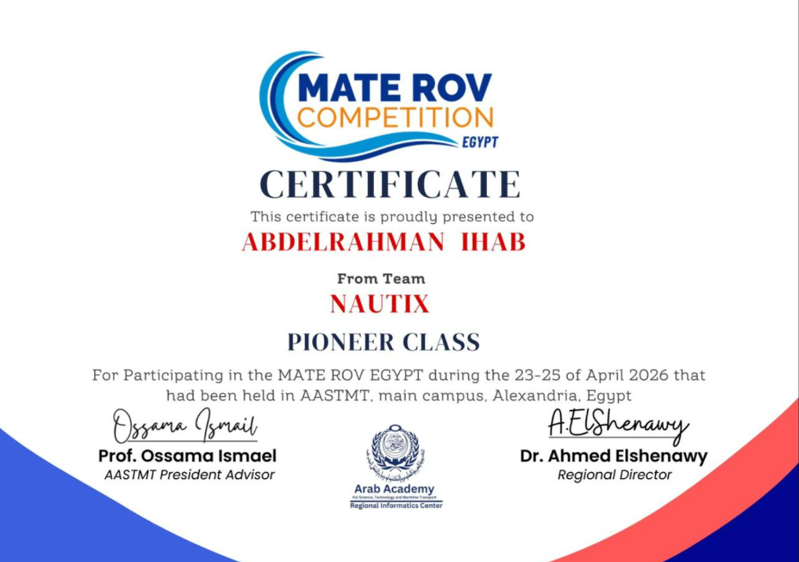

# 🏆 Nautix — MATE ROV 2026 Pioneer Level  
### Underwater Robotics • Computer Vision • AI Engineering

<p align="center">
  
</p>

<p align="center">
🥇 1st Place — MATE ROV 2026 Pioneer Level  
<br>
🎖 Best Design Award  
<br>
🎤 Best Presentation Award
</p>

---

# 📌 Overview

Nautix is an AI-powered underwater robotics project developed for the **MATE ROV 2026 Pioneer Level Competition**.

The project combines:

- Underwater robotics
- Computer vision
- AI-based object detection
- Biodiversity analysis
- 3D environmental reconstruction

Our system was designed to assist in underwater exploration and marine ecosystem analysis using real-time computer vision techniques.

The team achieved:

- 🥇 1st Place — Pioneer Level
- 🎖 Best Design Award
- 🎤 Best Presentation Award

and qualified for the international competition in Canada.

---

# 🚀 Features

## 🦀 European Green Crab Detection
- Built a YOLOv8-based underwater object detection system
- Trained using synthetic data augmentation due to limited real-world underwater datasets
- Detects invasive European Green Crabs in challenging underwater conditions

## 📈 Trajectory Recovery System
- Implemented interpolation techniques for recovering missing object trajectories
- Achieved >95% trajectory continuity during testing

## 🌊 3D Coral Garden Reconstruction
- Built a photogrammetry-inspired reconstruction pipeline
- Applied spatial calibration and metric scaling
- Generated scientifically usable coral analysis outputs

## 🤖 Real-Time Underwater AI
- Optimized for underwater video conditions
- Handles low visibility, distortion, and lighting variations

---

# 🧠 My Role in the Team

I worked as the:

# 🎯 Computer Vision / AI Engineer

My responsibilities included:

- Developing the YOLOv8 detection pipeline
- Training custom underwater detection models
- Building trajectory interpolation systems
- Implementing 3D coral reconstruction
- Optimizing underwater image preprocessing
- Assisting in testing and deployment

---

# 🛠 Technologies Used

## Programming
- Python

## AI / Deep Learning
- YOLOv8
- OpenCV
- NumPy

## Computer Vision
- Object Detection
- Image Processing
- Homography
- Trajectory Analysis
- 3D Reconstruction

## Development Tools
- Google Colab
- Jupyter Notebook
- Git & GitHub

---

# 📊 System Pipeline

```text
Underwater Camera Feed
        ↓
Image Preprocessing
        ↓
YOLOv8 Object Detection
        ↓
Trajectory Tracking
        ↓
Interpolation Recovery
        ↓
3D Coral Reconstruction
        ↓
Scientific Analysis Output
```

---

# 📷 Project Demonstration

## Underwater Detection
<p align="center">
  
</p>

## Coral Reconstruction
<p align="center">
  
</p>

## Competition Showcase
<p align="center">
  
</p>

---

# 📈 Results

| Feature | Result |
|---|---|
| Object Detection | Successful underwater detection |
| Trajectory Continuity | >95% |
| Coral Reconstruction | Successful |
| Competition Result | 🥇 1st Place |
| Additional Awards | Best Design + Best Presentation |

---

# 🌍 Real-World Impact

This project demonstrates how AI and robotics can support:

- Marine biodiversity monitoring
- Underwater ecosystem analysis
- Environmental research
- Smart underwater exploration
- Autonomous robotics systems

---

# 🏅 Competition Achievement

## MATE ROV 2026 — Pioneer Level

Achievements:
- 🥇 1st Place
- 🎖 Best Design Award
- 🎤 Best Presentation Award

Qualified for:
- 🌎 International Competition — Canada

---

# 🔗 Project Links

- GitHub Repository:  
  https://github.com/Abdelrahman-288/Mate-ROV-Pioneer-2026

- Portfolio Website:  
  https://abdelrahman-288.github.io

- LinkedIn:  
  https://www.linkedin.com/in/abdelrahmanihab288

---

# 👨‍💻 Author

## Abdelrahman Ihab

AI Engineer • Computer Vision • Cybersecurity • Robotics

Computer Engineering Student at E-JUST

---

# ⭐ Support

If you found this project interesting, consider giving it a star ⭐
